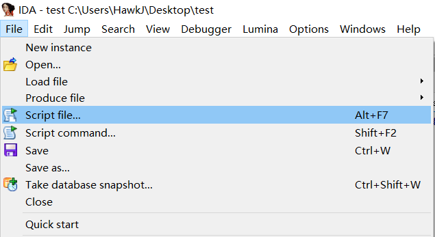
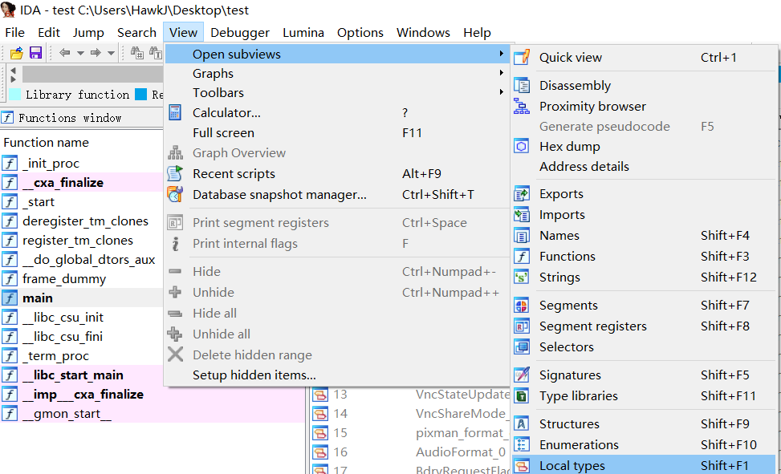
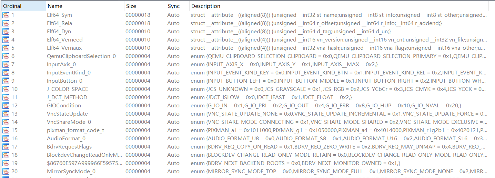
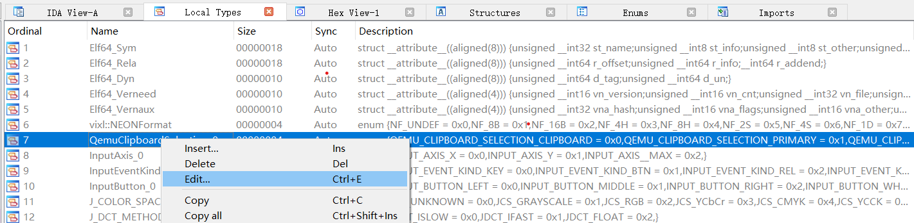
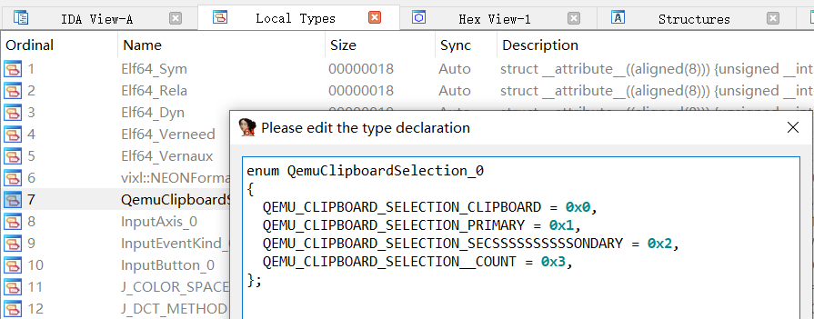
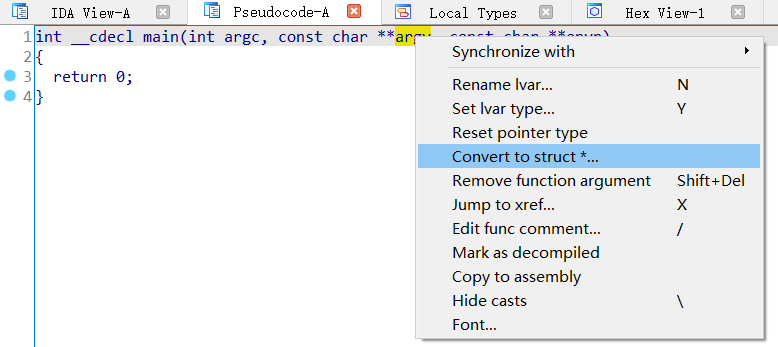
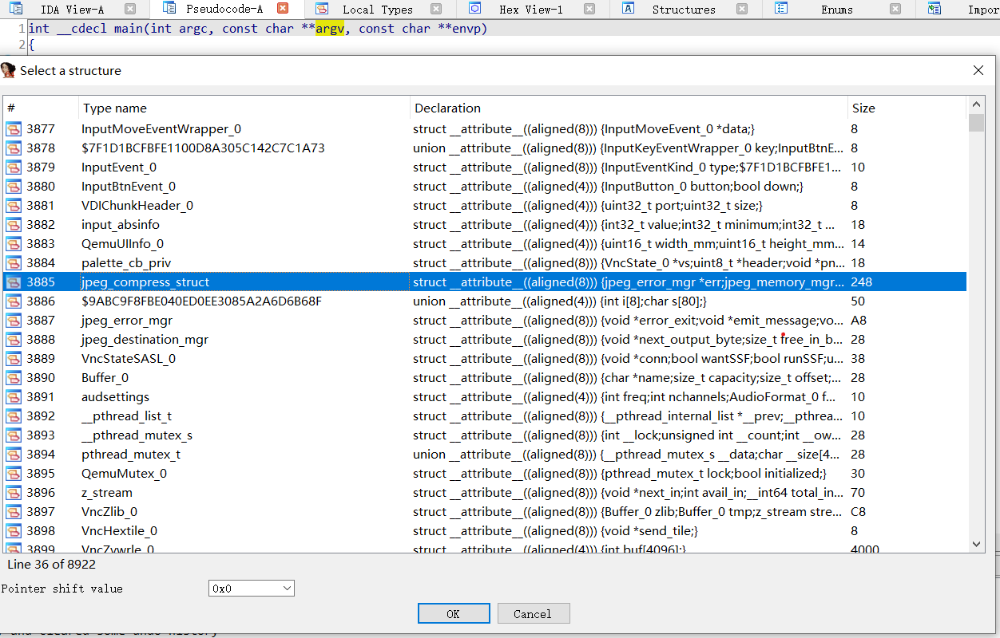

# gDwarf

this repo collects some **idc scripts**, which can import **structure**s from common software, into the program you are analyzing.

## Supported Software

### Linux Kernel

| version | link |
| :--: | :--: |
|5.15 | https://github.com/Augment-Decompiler/gDwarf/blob/main/vmlinux/vmlinux-5.15.idc |
|5.10 | https://github.com/Augment-Decompiler/gDwarf/blob/main/vmlinux/vmlinux-5.10.idc |
|5.4 | https://github.com/Augment-Decompiler/gDwarf/blob/main/vmlinux/vmlinux-5.4.idc |
|4.19 | https://github.com/Augment-Decompiler/gDwarf/blob/main/vmlinux/vmlinux-4.19.idc |
|4.14 | https://github.com/Augment-Decompiler/gDwarf/blob/main/vmlinux/vmlinux-4.14.idc |
|4.9 | https://github.com/Augment-Decompiler/gDwarf/blob/main/vmlinux/vmlinux-4.9.idc |
|4.4 | https://github.com/Augment-Decompiler/gDwarf/blob/main/vmlinux/vmlinux-4.4.idc |

### Qemu

| version | arch | link |
| :--: | :--: | :--: |
| 6.2.0 | aarch64 | https://github.com/Augment-Decompiler/gDwarf/blob/main/qemu/6.2.0/qemu-system-aarch64.idc |
| 6.2.0 | alpha | https://github.com/Augment-Decompiler/gDwarf/blob/main/qemu/6.2.0/qemu-system-alpha.idc |
| 6.2.0 | arm | https://github.com/Augment-Decompiler/gDwarf/blob/main/qemu/6.2.0/qemu-system-arm.idc |
| 6.2.0 | avr | https://github.com/Augment-Decompiler/gDwarf/blob/main/qemu/6.2.0/qemu-system-avr.idc |
| 6.2.0 | cris | https://github.com/Augment-Decompiler/gDwarf/blob/main/qemu/6.2.0/qemu-system-cris.idc |
| 6.2.0 | hppa | https://github.com/Augment-Decompiler/gDwarf/blob/main/qemu/6.2.0/qemu-system-hppa.idc |
| 6.2.0 | i386 | https://github.com/Augment-Decompiler/gDwarf/blob/main/qemu/6.2.0/qemu-system-i386.idc |
| 6.2.0 | m68k | https://github.com/Augment-Decompiler/gDwarf/blob/main/qemu/6.2.0/qemu-system-m68k.idc |
| 6.2.0 | microblaze | https://github.com/Augment-Decompiler/gDwarf/blob/main/qemu/6.2.0/qemu-system-microblaze.idc |
| 6.2.0 | mips | https://github.com/Augment-Decompiler/gDwarf/blob/main/qemu/6.2.0/qemu-system-mips.idc |
| 6.2.0 | mips64 | https://github.com/Augment-Decompiler/gDwarf/blob/main/qemu/6.2.0/qemu-system-mips64.idc |
| 6.2.0 | mips64el | https://github.com/Augment-Decompiler/gDwarf/blob/main/qemu/6.2.0/qemu-system-mips64el.idc |
| 6.2.0 | mipsel | https://github.com/Augment-Decompiler/gDwarf/blob/main/qemu/6.2.0/qemu-system-mipsel.idc |
| 6.2.0 | nios2 | https://github.com/Augment-Decompiler/gDwarf/blob/main/qemu/6.2.0/qemu-system-nios2.idc |
| 6.2.0 | or1k | https://github.com/Augment-Decompiler/gDwarf/blob/main/qemu/6.2.0/qemu-system-or1k.idc |
| 6.2.0 | ppc | https://github.com/Augment-Decompiler/gDwarf/blob/main/qemu/6.2.0/qemu-system-ppc.idc |
| 6.2.0 | ppc64 | https://github.com/Augment-Decompiler/gDwarf/blob/main/qemu/6.2.0/qemu-system-ppc64.idc |
| 6.2.0 | riscv32 | https://github.com/Augment-Decompiler/gDwarf/blob/main/qemu/6.2.0/qemu-system-riscv32.idc |
| 6.2.0 | riscv64 | https://github.com/Augment-Decompiler/gDwarf/blob/main/qemu/6.2.0/qemu-system-riscv64.idc |
| 6.2.0 | rx | https://github.com/Augment-Decompiler/gDwarf/blob/main/qemu/6.2.0/qemu-system-rx.idc |
| 6.2.0 | s390x | https://github.com/Augment-Decompiler/gDwarf/blob/main/qemu/6.2.0/qemu-system-s390x.idc |
| 6.2.0 | sh4 | https://github.com/Augment-Decompiler/gDwarf/blob/main/qemu/6.2.0/qemu-system-sh4.idc |
| 6.2.0 | sh4eb | https://github.com/Augment-Decompiler/gDwarf/blob/main/qemu/6.2.0/qemu-system-sh4eb.idc |
| 6.2.0 | sparc | https://github.com/Augment-Decompiler/gDwarf/blob/main/qemu/6.2.0/qemu-system-sparc.idc |
| 6.2.0 | sparc64 | https://github.com/Augment-Decompiler/gDwarf/blob/main/qemu/6.2.0/qemu-system-sparc64.idc |
| 6.2.0 | tricore | https://github.com/Augment-Decompiler/gDwarf/blob/main/qemu/6.2.0/qemu-system-tricore.idc |
| 6.2.0 | x86_64 | https://github.com/Augment-Decompiler/gDwarf/blob/main/qemu/6.2.0/qemu-system-x86_64.idc |
| 6.2.0 | xtensa | https://github.com/Augment-Decompiler/gDwarf/blob/main/qemu/6.2.0/qemu-system-xtensa.idc |
| 6.2.0 | xtensaeb | https://github.com/Augment-Decompiler/gDwarf/blob/main/qemu/6.2.0/qemu-system-xtensaeb.idc |

## Usage

### import structure

1. **left-click** the **File**->**Script file**，then select the relative idc script file above

2. **left-click** the **View**->**Open subviews**->**Local types**，then the import structures are in this window.

### edit structure

1. select the structure to edit in **Local types** windows，then **right-click** the item, **left-click** the **Edit..**

2. edit the structure definition in **C** code in the subwindow

### convert to structure

1. **left-click** the variable in pseudocode by **F5**, then **right-click** the item, **left-click** the **Convert to struct \*...**

2. select the **import structure** you want the variable to convert to in subwindow
